# OpenShift Preparation Labs


Duration: 30 minutes


##  Introduction

During this lab, we are going to set up your laptop to be prepared to all labs during this workshop. You should be able to connect to an **OpenShift** Cluster thru the Web Console and navigate thru the different kubernetes resources.

The instructor has already built an OpenShift Cluster version 4.x for you. 

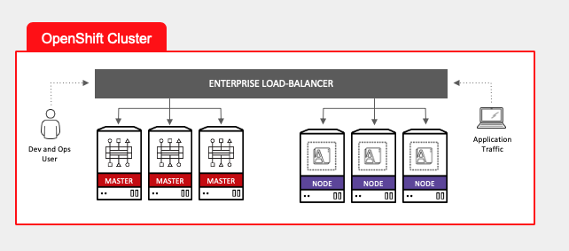

As you can see on the picture, you will connect to the OpenShift Cluster Web UI to the Master VMs for management and development purposes. The end-users will connect to the applications thru the Nodes.


## Task #1 - IBM Cloud account

The OpenShift platform that we are going to use has been built on IBM Cloud. 

```http
https://cloud.ibm.com
```

Type your User ID password and click Login button given by the **instructor**:

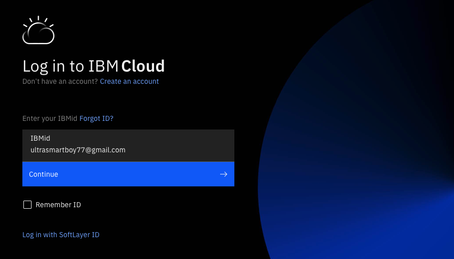

You should see the following **Dashboard**:

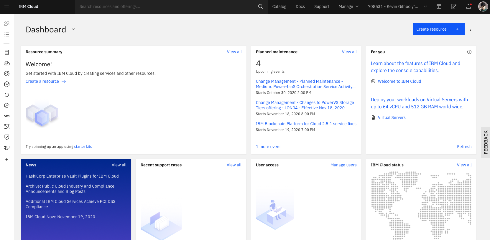


The instructor will also give you a project name like **labproj<xx>**. Each person has its own  project with a specific number <xx>.

> Please use that project that has been assigned to you during all labs.


## Task #2 - Connecting to the OpenShift Console

To get access to the OpenShift Console, first connect to **IBM Cloud with your own credentials**. 

The instructor should have authorized you to get access to the **Kevin** Account. On the top right of the screen, click your name and then you should see the Kevin's account (click on the Kevin's account):

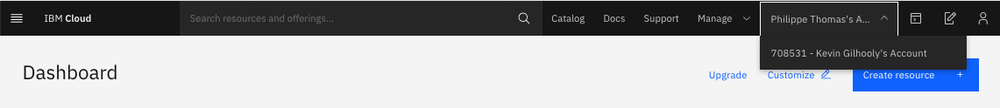

Then, the following page should appear (with one cluster)

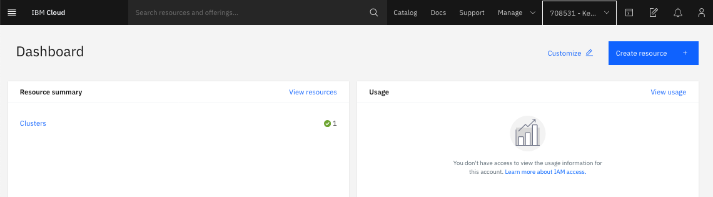

Click on that **cluster** to show the list:

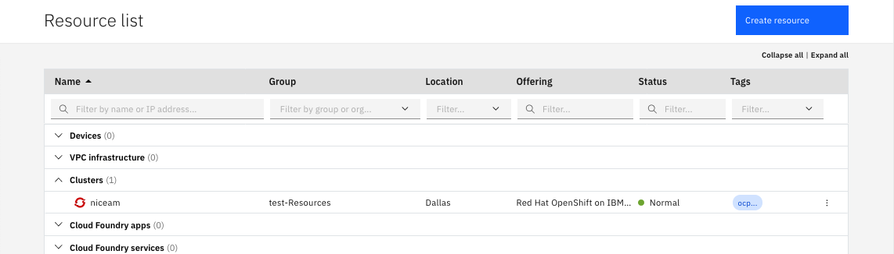

And then click on the cluster to see details about that cluster:

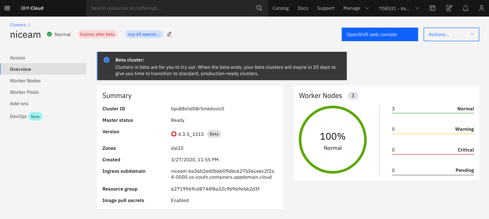

From this point, you can navigate on that cluster and look about some details like the version, the cluster ID, the zones, and the ingress subdomains. 

Then click on the worker nodes on the left pane to see the workers:


To get access to the OpenShift console click on the blue button (OpenShift web console) and a new tab should open:

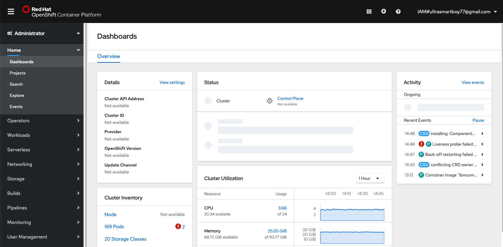


> Please take a note of the link because we will use it very often.

Of course you can navigate in the console and switch between the 2 profiles : Administrator and Developer :

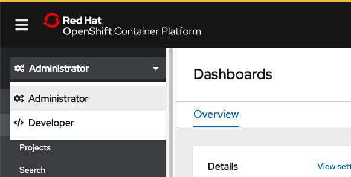


##  Task #3 - Installing the OpenShift CLI

In fact, you will need to use the **oc** command during the labs. If you need some more information during the installation, go to that link

<https://cloud.ibm.com/docs/openshift?topic=openshift-openshift-cli>

This link is very practical to download both the **oc** and the associated **kubectl**.

> During the labs, you will notice that the oc command is a superset of the kubectl command. 
>
> To view a local version of the OpenShift dashboard and to deploy apps into your Red Hat OpenShift on IBM Cloud clusters, install the OpenShift Origin CLI (`oc`). The `oc` CLI includes a matching version of the Kubernetes CLI (`kubectl`). For more information, see the [OpenShift docs ](https://docs.openshift.com/container-platform/3.11/cli_reference/get_started_cli.html).

From the top of the page, locate and click the interrogation mark and the Command line tools:

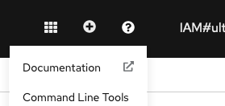

Locate the section concerning the OpenShift CLI:

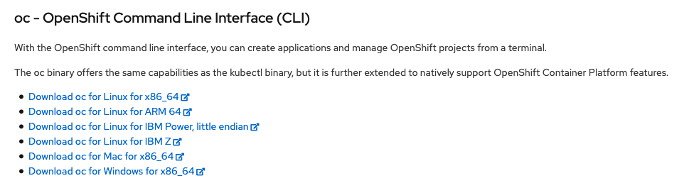

Choose the link concerning your OS running on your lap top. This will download the right oc version corresponding to right version of OpenShift.

If you use **Windows**, install the `oc` CLI in any other directory that is listed in your `PATH`  system variables. This setup saves you some file path changes when you run commands later.

If you use **MacOS** or **Linux**, complete the following steps to add the binaries to your `PATH` system variable. 

1. Extract and Move the `oc` and `kubectl` executable files to the `/usr/local/bin` directory.

   ```
   mv /<filepath>/oc /usr/local/bin/oc
   ```

2. Make sure that `/usr/local/bin` is listed in your `PATH` system variable. The `PATH` variable contains all directories where your operating system can find executable files. The directories that are listed in the `PATH` variable serve different purposes. `/usr/local/bin` is used to store executable files for software that is not part of the operating system and that was manually installed by the system administrator.

   ```
   echo $PATH
   ```

   Example CLI output:

   ```
   /usr/local/bin:/usr/bin:/bin:/usr/sbin:/sbin
   ```


### 3. Check the OC command

To use the oc command, you normally need to use a login with user and password or a token.

From the web console, click on the user ID on the top right part of the console and pick copy login Command:

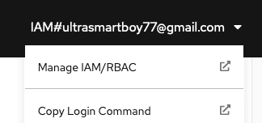

A new tab will open shortly:

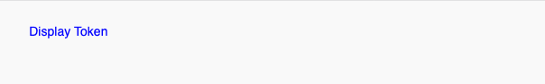

Click on **Display Token** and you can see an example of the login command (this command will be available for the next 24 hours):

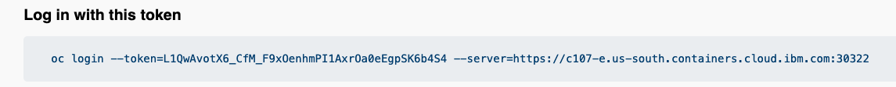

> **IMPORTANT**: Take a note of the full login command line


Open a terminal or a command line console and paste the previous command:

```shell
oc login --token=L1QwAvotX6_CfM_F9xOenhmPI1AxrOa0eEgpSK6b4S4 --server=https://c107-e.us-south.containers.cloud.ibm.com:30322
```

Result as an example:

```shell
oc login --token=L1QwAvotX6_CfM_F9xOenhmPI1AxrOa0eEgpSK6b4S4 --server=https://c107-e.us-south.containers.cloud.ibm.com:30322
Logged into "https://c107-e.us-south.containers.cloud.ibm.com:30322" as "IAM#ultrasmartboy77@gmail.com" using the token provided.

You have access to 68 projects, the list has been suppressed. You can list all projects with 'oc projects'

Using project "labproj99".
```

> **You don't need to create a new project because a new secure project space has already been created for you.** 

If you had to create a new project, you would have typed : oc new-project labproj<xx> where **xx** is your number.

To switch to your project:

``` bash
oc project labproj<XX>
```

Results as an example:

```shell
oc project labproj99
Already on project "labproj99" on server "https://c107-e.us-south.containers.cloud.ibm.com:30322".
```


To understand what project you are using:

```
oc projects
```

Results:

```shell
oc projects
You have access to the following projects and can switch between them with 'oc project <projectname>':

    adminproj
    calico-system
    default
    ibm-cert-store
    ibm-system
    kabanero
    kappnav
    knative-serving
    knative-serving-ingress
    kube-node-lease
    kube-public
    kube-system
  * labproj99
    multicluster-endpoint
    niceam-cluster
    ...
    tekton-pipelines
    tigera-operator

Using project "labproj99" on server "https://c107-e.us-south.containers.cloud.ibm.com:30322".
```


Now you are ready to go thru the exercises. 


## Task #4 - Deploy some code

Now go back to the Web UI and deploy your first application.

Switch to the **Developer** profile and click on **Topology**:

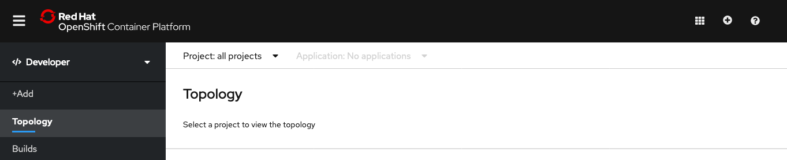

Select on your project name (labprojxx): 

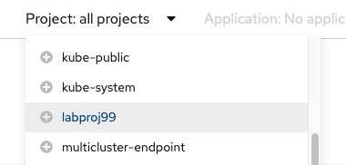

The following sceen should appear (no workload found):

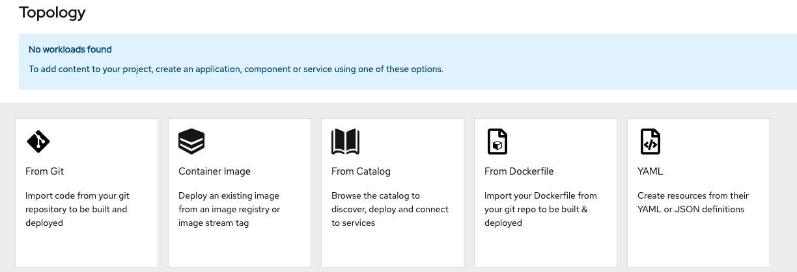


On the **From catalog**, find the **Node.js** tile. 

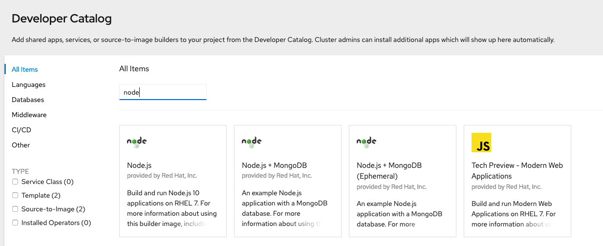

Select **Node.js** entry and then click on **Create Application** button

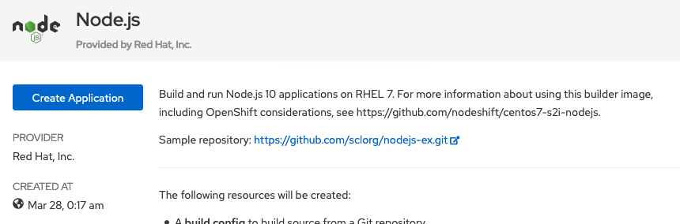


The following resources will be created:

- A build config to build source from a Git repository.
- An image stream to track built images.
- A deployment config to rollout new revisions when the image changes.
- A service to expose your workload inside the cluster.
- An optional route to expose your workload outside the cluster.

You can have a look to the github **sample** repository. 

``` http
 https://github.com/sclorg/nodejs-ex.git
```


You can see that the builder (S2I) is version 12 for Node.js in the **build section**.


In the **Git section**, click in the **Try Sample** so you get the sample git repo URL filled in:


Then in the General section, names are already there:

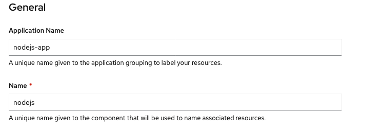


Go to the bottom and click **Create**

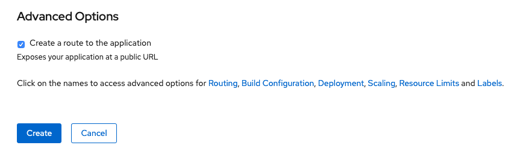

After a few minutes, the new application has been created:


On this view, you can see the name of the application **nodejs-app**, the deployment **nodejs** and the runtime Node.js. 

Click in the middle of the **circle**:

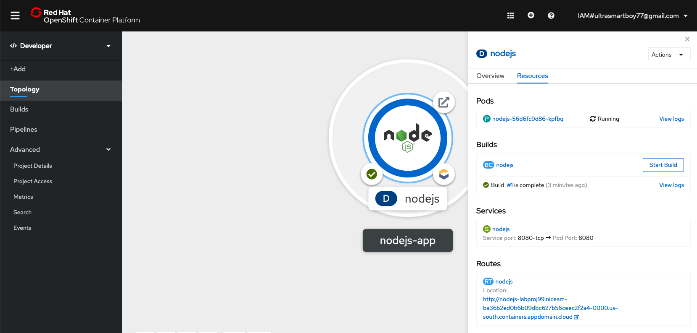


You can now see some details of your application: Pods, Builds, Service and Route.

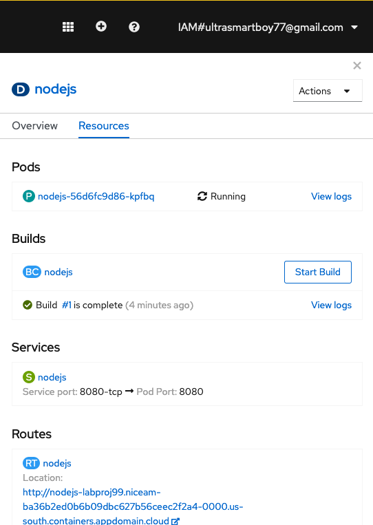

To get access to your application, you have to find the route: go to **Application** on the pane and the click on  the blue**Route Link** and voilà ! You get access to your application.

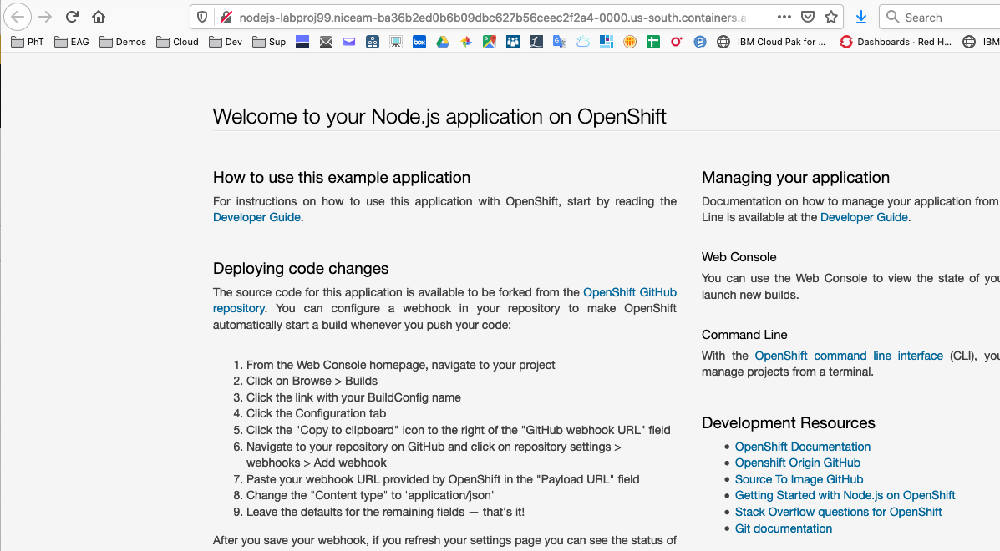


## Conclusion

**Congrats !**  You successfully installed and used the oc CLI and the OpenShift web console thru the installation of a typical Node.JS application (from Github). 

You noticed the following details:

- easy to install for the oc CLI
- easy to access the OpenShift web console
- easy to build and deploy a simple application with the console.


----

----


# End of Lab


