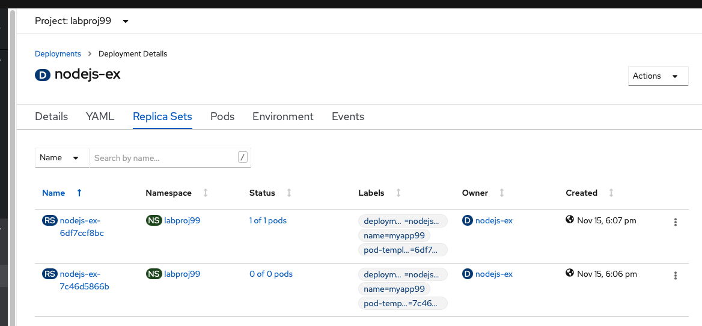
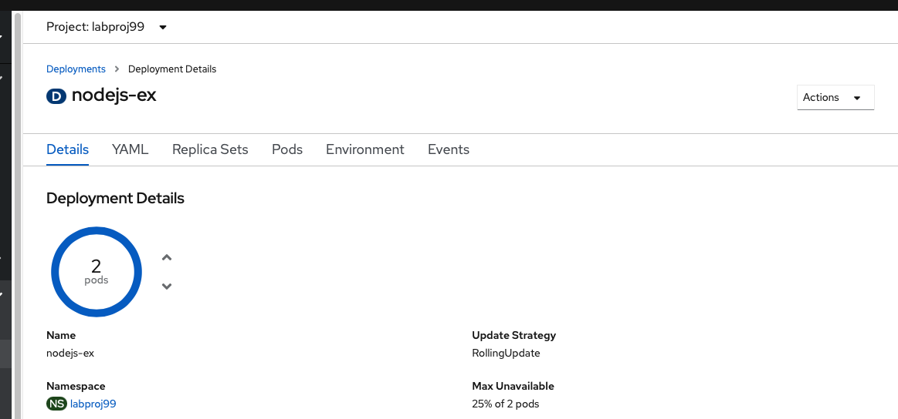

# OpenShift Web Console & CLI Labs


Duration : 30 minutes


##  Introduction

During this lab we are going to connect to an **OpenShift** Cluster thru the CLI. Then we will deploy a sample application.

Be sure that you have your labproj<xx>

Don't use someone else labproj<xx> except if the instructor ask you to do so. 


## Task #1 - Connect to your OpenShift Cluster

To get access to the OpenShift Web Console, first connect to **IBM Cloud with your own credentials**. 

And then click on the blue button in the OpenShift Cluster:


Be sure you also have opened a terminal or a command line window and that you are connected (remember that you can get your token from the "Copy login Command"):


```shell
oc login --token=WSbrwyMhiUFRwN5vHw0eqchqwYyVNJFDvw-aKiffDTQ --server=https://c107-e.us-south.containers.cloud.ibm.com:30322
```


Be sure you are working on your **project**<xx> by typing the following command:

```bash
oc status
```

Results:

```bash
oc status
In project Testing project for education (labproj99) on server https://c107-e.us-south.containers.cloud.ibm.com:30322

http://nodejs-labproj99.niceam-ba36b2ed0b6b09dbc627b56ceec2f2a4-0000.us-south.containers.appdomain.cloud to pod port 8080-tcp (svc/nodejs)
  deployment/nodejs deploys istag/nodejs:latest <-
    bc/nodejs source builds https://github.com/sclorg/nodejs-ex.git on openshift/nodejs:10-SCL 
    deployment #2 running for 17 minutes - 1 pod
    deployment #1 deployed 18 minutes ago
```

From the web console, you go to your project<xx> and delete the previous application.

Click on the black button "**nodejs-app**" to show the right pane:


Then click on action and then delete the application:


Then type the name of your application and click delete:


The project should be empty. 


## Task #2 - Starting a basic application

For this exercise, we will use the CLI and then switch to the OpenShift web console.

We built a basic node.js application using the following GitHub repo that you can see here (thanks to sclorg):

<https://github.com/sclorg/nodejs-ex>

Create a new instance Node.js application based on this GitHub example **(change xx with your number)**

```bash
oc new-app https://github.com/sclorg/nodejs-ex -l name=myapp<xx>
```

After a few seconds:

```bash
oc new-app https://github.com/sclorg/nodejs-ex -l name=myapp99
--> Found image 92fa44e (6 days old) in image stream "openshift/nodejs" under tag "12" for "nodejs"

    Node.js 12 
    ---------- 
    Node.js 12 available as container is a base platform for building and running various Node.js 12 applications and frameworks. Node.js is a platform built on Chrome's JavaScript runtime for easily building fast, scalable network applications. Node.js uses an event-driven, non-blocking I/O model that makes it lightweight and efficient, perfect for data-intensive real-time applications that run across distributed devices.

    Tags: builder, nodejs, nodejs12

    * The source repository appears to match: nodejs
    * A source build using source code from https://github.com/sclorg/nodejs-ex will be created
      * The resulting image will be pushed to image stream tag "nodejs-ex:latest"
      * Use 'oc start-build' to trigger a new build

--> Creating resources with label name=myapp99 ...
    imagestream.image.openshift.io "nodejs-ex" created
    buildconfig.build.openshift.io "nodejs-ex" created
    deployment.apps "nodejs-ex" created
    service "nodejs-ex" created
--> Success
    Build scheduled, use 'oc logs -f bc/nodejs-ex' to track its progress.
    Application is not exposed. You can expose services to the outside world by executing one or more of the commands below:
     'oc expose svc/nodejs-ex' 
    Run 'oc status' to view your app.
#
```


For that exercise, we just provide the code (the server.js file in the GitHub and some config files). 

> You can note that OpenShift if going to find itself that the provided code is Node.JS and then find a version 10 that can match this code. Then an image stream is built with the name **nodejs-ex** and stored in the registry. Then after the build, a deployment is done and the application is running with success.  


Track the build log until the app is built and deployed:

```bash
oc logs -f bc/nodejs-ex
```

Results:

```bash
oc logs -f bc/nodejs-ex
Cloning "https://github.com/sclorg/nodejs-ex" ...
	Commit:	a096bd299d65517cef8079f4559e9b0b9f97ff57 (Merge pull request #237 from bparees/nodejs12)
	Author:	Honza Horak <hhorak@redhat.com>
	Date:	Tue Mar 3 16:35:01 2020 +0100
Caching blobs under "/var/cache/blobs".
Getting image source signatures
Copying blob sha256:81aa2695e9554e4aa95038da2bfa0ed5c5c5bc89894b4b6b4835494ebfbad26a
Copying blob sha256:84e620d0abe585d05a7bed55144af0bc5efe083aed05eac1e88922034ddf1ed2
Copying blob sha256:46fc24a071a44b29a3ba49c94f75a47514a56470d539c9204f3e7688973fc93a
Copying blob sha256:455ea8ab06218495bbbcb14b750a0d644897b24f8c5dcf9e8698e27882583412
Copying blob sha256:bb13d92caffa705f32b8a7f9f661e07ddede310c6ccfa78fb53a49539740e29b
Copying config sha256:3e32112e4287d3f7253b2c1c177de3270e5aed79704a1c6dd0106a7ef35bf5f0
Writing manifest to image destination
Storing signatures
Generating dockerfile with builder image image-registry.openshift-image-registry.svc:5000/openshift/nodejs@sha256:3969e466985c863267bfa75c5c8bcdc9f3560cf5413c16530307013e486ba71c
STEP 1: FROM image-registry.openshift-image-registry.svc:5000/openshift/nodejs@sha256:3969e466985c863267bfa75c5c8bcdc9f3560cf5413c16530307013e486ba71c
STEP 2: LABEL "io.openshift.build.commit.date"="Tue Mar 3 16:35:01 2020 +0100" "io.openshift.build.commit.id"="a096bd299d65517cef8079f4559e9b0b9f97ff57" "io.openshift.build.commit.ref"="master" "io.openshift.build.commit.message"="Merge pull request #237 from bparees/nodejs12" "io.openshift.build.source-location"="https://github.com/sclorg/nodejs-ex" "io.openshift.build.image"="image-registry.openshift-image-registry.svc:5000/openshift/nodejs@sha256:3969e466985c863267bfa75c5c8bcdc9f3560cf5413c16530307013e486ba71c" "io.openshift.build.commit.author"="Honza Horak <hhorak@redhat.com>"
STEP 3: ENV OPENSHIFT_BUILD_NAME="nodejs-ex-1" OPENSHIFT_BUILD_NAMESPACE="labproj99" OPENSHIFT_BUILD_SOURCE="https://github.com/sclorg/nodejs-ex" OPENSHIFT_BUILD_COMMIT="a096bd299d65517cef8079f4559e9b0b9f97ff57"
STEP 4: USER root
STEP 5: COPY upload/src /tmp/src
STEP 6: RUN chown -R 1001:0 /tmp/src
STEP 7: USER 1001
STEP 8: RUN /usr/libexec/s2i/assemble
---> Installing application source ...
---> Installing all dependencies
npm WARN deprecated jade@0.26.3: Jade has been renamed to pug, please install the latest version of pug instead of jade
npm WARN deprecated mkdirp@0.5.1: Legacy versions of mkdirp are no longer supported. Please update to mkdirp 1.x. (Note that the API surface has changed to use Promises in 1.x.)
npm WARN deprecated to-iso-string@0.0.2: to-iso-string has been deprecated, use @segment/to-iso-string instead.
npm WARN deprecated mkdirp@0.3.0: Legacy versions of mkdirp are no longer supported. Please update to mkdirp 1.x. (Note that the API surface has changed to use Promises in 1.x.)
npm WARN deprecated minimatch@0.3.0: Please update to minimatch 3.0.2 or higher to avoid a RegExp DoS issue

> ejs@2.7.4 postinstall /opt/app-root/src/node_modules/ejs
> node ./postinstall.js

Thank you for installing EJS: built with the Jake JavaScript build tool (https://jakejs.com/)

npm notice created a lockfile as package-lock.json. You should commit this file.
added 121 packages from 342 contributors and audited 205 packages in 6.346s
found 10 vulnerabilities (3 low, 2 moderate, 4 high, 1 critical)
  run `npm audit fix` to fix them, or `npm audit` for details
---> Building in production mode
---> Pruning the development dependencies
audited 205 packages in 1.139s
found 10 vulnerabilities (3 low, 2 moderate, 4 high, 1 critical)
  run `npm audit fix` to fix them, or `npm audit` for details
/opt/app-root/src/.npm is not a mountpoint
---> Cleaning the npm cache /opt/app-root/src/.npm
/tmp is not a mountpoint
---> Cleaning the /tmp/npm-*
STEP 9: CMD /usr/libexec/s2i/run
STEP 10: COMMIT temp.builder.openshift.io/labproj99/nodejs-ex-1:cf141784
Getting image source signatures
Copying blob sha256:35817540a17b5b90cb4426078d53813b16e70c75e1cce3db116d2fbbca7fbf10
Copying blob sha256:c7fbe90ae90e9c6452e5d809f069907907e6f32532565104921f600fb956306c
Copying blob sha256:74d760a83a4b8bcb3d01e7726e06c11469f0bb2ce4645474cb91a607c27bf482
Copying blob sha256:84ecc5257b90d8d8b51cf749f244f3b7b5d949e4d2761f7522bebd81f07d2ecb
Copying blob sha256:2a72856523ed3830ed849bc9ce8cccc7da245495fabea7b26d2b838f4ed02ce3
Copying blob sha256:1a2f0fb94c4b01cdbdc80cdbc9d1ab8a6260e9f7181a25f533df663ab5cada76
Copying config sha256:752c0f078cb800ae28e113a82c476517cdd1f5aa55f59356a1a99c03296fbb1b
Writing manifest to image destination
Storing signatures
752c0f078cb800ae28e113a82c476517cdd1f5aa55f59356a1a99c03296fbb1b
752c0f078cb800ae28e113a82c476517cdd1f5aa55f59356a1a99c03296fbb1b

Pushing image image-registry.openshift-image-registry.svc:5000/labproj99/nodejs-ex:latest ...
Getting image source signatures
Copying blob sha256:84e620d0abe585d05a7bed55144af0bc5efe083aed05eac1e88922034ddf1ed2
Copying blob sha256:455ea8ab06218495bbbcb14b750a0d644897b24f8c5dcf9e8698e27882583412
Copying blob sha256:bb13d92caffa705f32b8a7f9f661e07ddede310c6ccfa78fb53a49539740e29b
Copying blob sha256:46fc24a071a44b29a3ba49c94f75a47514a56470d539c9204f3e7688973fc93a
Copying blob sha256:81aa2695e9554e4aa95038da2bfa0ed5c5c5bc89894b4b6b4835494ebfbad26a
Copying blob sha256:1a2f0fb94c4b01cdbdc80cdbc9d1ab8a6260e9f7181a25f533df663ab5cada76
Copying config sha256:752c0f078cb800ae28e113a82c476517cdd1f5aa55f59356a1a99c03296fbb1b
Writing manifest to image destination
Storing signatures
Successfully pushed image-registry.openshift-image-registry.svc:5000/labproj99/nodejs-ex@sha256:081f42b26e27d2308ea444f4cc4e50fd9bb953977d58245bfecc13d61d9a97a2
Push successful

```


If you are familiar with Git, Docker and Kubernetes, you will notice several activities:

- a clone of the github repo 
- npm (because it is a Node.js source) is used to solve the lib dependencies. 
- Finally a docker container image is stored in the OpenShift registry (push)

To check that your application is running:

```bash
oc get pods
```

Results:

```bash
# oc get pods
NAME                         READY   STATUS      RESTARTS   AGE
nodejs-ex-1-build            0/1     Completed   0          101s
nodejs-ex-6df7ccf8bc-p5m8b   1/1     Running     0          35s
```


You will notice that one pod (job) has been completed for the **build** stage.

The other pod is running (1/1) and this is our Node.JS application.

To make this application visible to the world, you should create a **route**. If you are familiar with Kubernetes, a route is very close concept of an ingress with the association of a DNS. 

Expose a route to the service:

```
oc expose svc/nodejs-ex
```

Results:

```bash
# oc expose svc/nodejs-ex
route.route.openshift.io/nodejs-ex exposed
```

But you don't know the route url yet. 

```bash
oc get route
```

Results

```
# oc get route
NAME        HOST/PORT                                        PATH      SERVICES    PORT       TERMINATION   WILDCARD
nodejs99    nodejs99-labproj99.niceam-ba36b2ed0b6b09dbc627b56ceec2f2a4-0000.us-south.containers.appdomain.cloud           nodejs99    8080-tcp                 None

```

Now you get the url. Sample results:

``` 
http://nodejs99-labproj99.niceam-ba36b2ed0b6b09dbc627b56ceec2f2a4-0000.us-south.containers.appdomain.cloud
```

You can notice the following :

- the url contains the project name **labproj<xx>**
- and also the OpenShift hostname (in that case **niceam-ba36b2ed0b6b09dbc627b56ceec2f2a4-0000** ) 
- using  IBM Cloud domain name **us-south.containers.appdomain.cloud**

Get access to this new application using this URL:

Example:

!


## Task #3 - OpenShift Web Console

Goto the OpenShift Web Console (Developer puis selectionner son project labproj<xx>)


You can see your application in the Topology section. 

Notice that we use also a **Deployment** (D) like in the first lab.

Go to the Administrator profile, select your project<xx> in the **Home>Projects section**:


The Dashboard of your project<xx> is very interesting because you can see a lot of informations: 

- Inventory of OpenShift objects like Pods, Deployments, Services ...
- Status (if some errors)
- Utilization (CPU, Memory ...)
- Activity (from the events)
- Quotas


Click on Pods to look at the **Pods** in Inventory in your labproj<xx>:


Now on the left pane, click on the **Deployment Configs** 


Let's click on the deployment: 


The YAML definitions:


The Replica Sets Tab:



The Pods Tab: 


The Environment Tab and finally the Events Tab (this log of events is concerning the activity around the deployment of the Pods):


If you go back to the Pods Tab:


You can notice that you have one pod that is running. **Click on that Pod**:


Now click in the log (concerning the application)


And then finally, click on the Terminal Tab to get access inside the container (try typing several linux commands):


## Task #4 - Scaling your application

To learn about scaling your application, on the left pane, click on the **Deployment**:


Finally, increase the number of pods (**not too much**: 2 for instance)


And after a while, you will see 2 active pods.


This mens that now 2 pods are serving the requests behin the same service. And all the requests will go in round robin automatically on one or the other pods.  

Now click on one of these new pods and you should a page like this one:


Let's try a crazy experience and kill this pod ! click on the action button and select `delete Pod`


The following popup window will appear:


Click on `Delete` and you should see breifly your pod terminating.


A new pod is automatically started !!! Because the number of replicaset has been defined to **2** , even if a pod is crashing or has been deleted, it will be replace automatically by a new one. 




## Conclusion

**Congrats !!!**  You successfully installed and used the oc CLI and the OpenShift web console thru the installation of a typical Node.JS application (from Github). 

You noticed the following details:

- easy to access the OpenShift web console
- easy to build and deploy the application, the container, the pod.
- easy to scale up and down 
- automatic healing

You also noticed the difference between Kubernetes and OpenShift like 

- the route concept
- the Deployment Config
- the wildcard DNS utilization in Routes
- the image stream and S2I concepts to build the docker image


----

----


# End of Lab


