# Kabanero-CodeWind-Appsody Tools 


## Introduction

What is **Kabanero** ?

Kabanero is an open source project focused on bringing together foundational open source technologies into a modern microservices-based framework. Developing apps for container platforms requires harmony between developers, architects, and operations. Today’s developers need to be efficient at much more than writing code. Architects and operations get overloaded with choices, standards, and compliance. Kabanero speeds development of applications built for Kubernetes while meeting the technology standards and policies your company defines. Design, develop, deploy, and manage with speed and control!

What is **codewind** ?

Codewind simplifies and enhances development in containers by extending industry standard IDEs with features to write, debug, and deploy cloud-native applications. Get started quickly with templates or samples, or pull in your applications and let Codewind get them cloud ready. 

What is **Appsody** ?

Appsody is designed to help you develop containerized applications for the cloud.

If you're a software developer, our aim is to greatly improve your developer experience by removing the burden of managing the full software development stack. With Appsody, you can build applications for the cloud that are ready to be deployed to Kubernetes without being an expert on the underlying container technology. You can simply focus on the important stuff - developing application code!

If you're responsible for defining standards for application runtime environments such as software levels, Appsody allows you to control the stacks that your developers use. You can define a set of technologies that are configurable, reusable, and already infused with cloud native capabilities. You get to implement and maintain your standards, ensuring consistency and reliability.

All these components are working all together. 


## Task #1 - Connect to your OpenShift web console

Be sure tp be connected to the OpenShift Web Console :

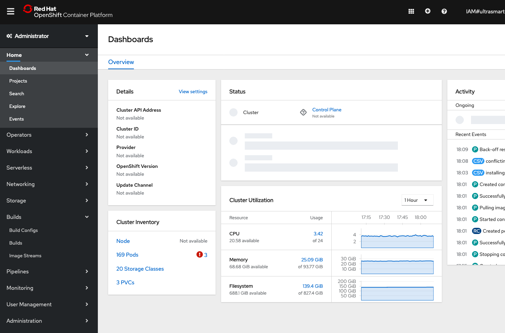


## Task #2 - Installing Appsody on your laptop

Before starting working with Appsody, you should install it on your workstation. 

The master reference is on the following link:

```http
https://appsody.dev/docs/getting-started/installation
```


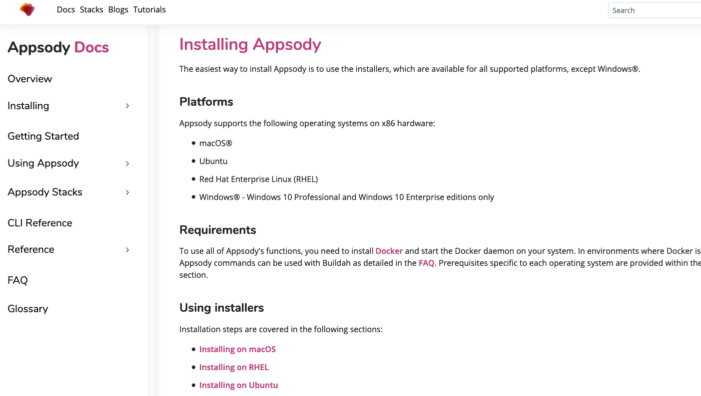

One of the most important thing that you will notice, is that with Appsody, you can really execute your application in Docker container running on your Laptop or remotely in a cluster.


### Check Docker has been installed on your laptop

Because Appsody depends on Docker, ensure that you have [Docker](https://docs.docker.com/get-started/) installed and the Docker daemon running on your system. 

On MacOS

<https://docs.docker.com/docker-for-mac/install/>

On Windows

<https://docs.docker.com/docker-for-windows/install/>


## Installing Appsody on macOS

Follow these steps:

1. If you don't have the Xcode command line tools installed on your system, install them by running `xcode-select --install`.
2. If you don't have Homebrew installed on your system, install it by running `/usr/bin/ruby -e "$(curl -fsSL https://raw.githubusercontent.com/Homebrew/install/master/install)"`.
3. To install Appsody, run:

```
brew install appsody/appsody/appsody
```

This command creates a brew tap for the `appsody/appsody` repo and installs the `appsody` formula.

 

##  Installing Appsody on Windows

Note: Appsody runs only on Windows 10 Professional and Windows 10 Enterprise editions. If you are running Windows 10 Enterprise with authentication through Azure Active Directory, please follow the additional instructions in the page [Appsody and Docker Desktop on Windows 10](https://appsody.dev/docs/docker-windows-aad).

Follow these steps:

1. Create a directory for Appsody on your Windows 10 system.
2. Download the **Appsody binaries for Windows** from the [Appsody releases page](https://github.com/appsody/appsody/releases) into the directory. The file is named `appsody-v.r.m-windows.tar.gz`, where `v.r.m` indicates the release tag.
3. Extract the files by running `tar -xvf appsody-v.r.m-windows.tar.gz`.

Note: If you choose to extract the files using a GUI tool you may have to extract the `appsody-v.r.m-windows.tar.gz` file and extract the extracted `appsody-v.r.m-windows.tar` file afterwards.

4. To install Appsody, run the following setup command:

```
appsody-setup.bat
```

That's all there is to it! 

Note that `appsody-setup.bat` does the following environment changes:

- It modifies your **PATH** environment variable - adding the folder where Appsody is installed to it - on the current command prompt session
- It creates an **APPSODY_PATH** [User Environment Variable](https://docs.microsoft.com/en-us/windows/win32/shell/user-environment-variables), set to the folder where Appsody is installed.
- Updates the **Path** User Environment Variable, appending **APPSODY_PATH** to it.


For the other Operating Systems, look at the following page: 

<https://appsody.dev/docs/getting-started/installation>


## Testing Appsody

Open a terminal or a command line console and type:

```bash
appsody
```

Results

```bash
The Appsody command-line tool (CLI) enables the rapid development of cloud native applications.

Complete documentation is available at https://appsody.dev

Usage:
  appsody [command]

Available Commands:
  build       Locally build a docker image of your appsody project
  completion  Generates bash tab completions
  debug       Run the local Appsody environment in debug mode
  deploy      Build and deploy your Appsody project to your Kubernetes cluster
  extract     Extract the stack and your Appsody project to a local directory
  help        Help about any command
  init        Initialize an Appsody project with a stack and template app
  list        List the Appsody stacks available to init
  operator    Install or uninstall the Appsody operator from your Kubernetes cluster.
  ps          List the appsody containers running in the local docker environment
  repo        Manage your Appsody repositories
  run         Run the local Appsody environment for your project
  stack       Tools to help create and test Appsody stacks
  stop        Stops the local Appsody docker container for your project
  test        Test your project in the local Appsody environment
  version     Show Appsody CLI version

Flags:
      --config string   config file (default is $HOME/.appsody/.appsody.yaml)
      --dryrun          Turns on dry run mode
  -h, --help            help for appsody
  -v, --verbose         Turns on debug output and logging to a file in $HOME/.appsody/logs

Use "appsody [command] --help" for more information about a command.
```


Appsody has **4** main subcommands that we use at different stages : 

- init, to scaffold a project
- build, to build or compile the application and the container
- run, to execute the container
- deploy to push that application into a kubernetes (or OpenShift) cluster.


## Task #3 - Kabanero Collections

Before creating our first application with Appsody, let's look at the collections.

From the OpenShift Web Console, click on the **Cloud Pack for Applications icon** on the top right part of the screen:

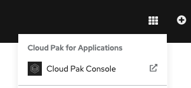

You should see the following page:

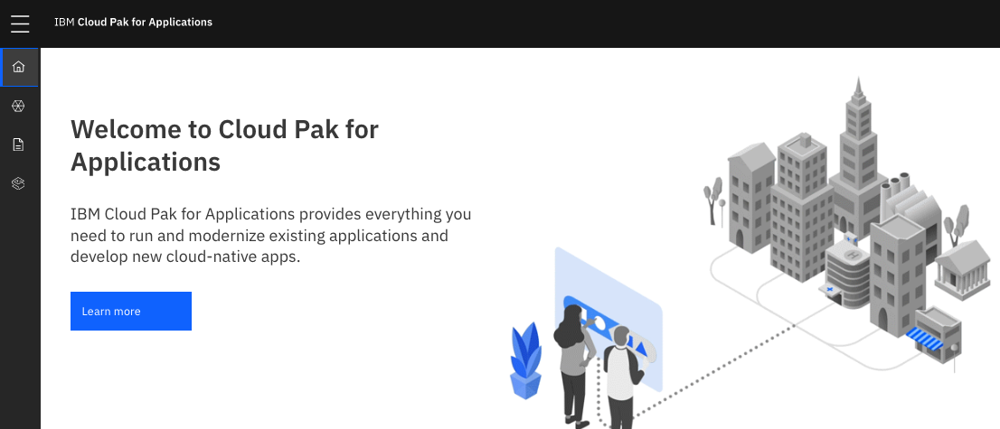


On the left pane, click on **Instance**:


In the middle of the screen, there is a list of links under instance:

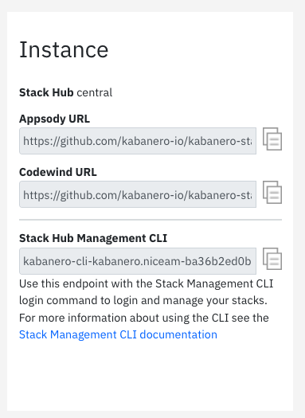


Take a note of the **Appsody Hub** that will be needed in the next steps. It looks like this:

``` http
https://github.com/kabanero-io/kabanero-stack-hub/releases/download/0.9.0/kabanero-stack-hub-index.yaml
```


What are the Kabanero Collections ?

The Kabanero project provides **solution architects** with the ability to manage integrated collections. Kabanero organizes **artifacts** into a collection that specifies an Appsody **stack**, **pipelines** based on Tekton with “Build Task Definitions”.

Kabanero Collections are logical collections, stored and managed in a **Github repository**. During the development phase, the collection seamlessly empowers developers to build applications and microservices to the architect’s standard configuration. Collections allow **standardization** and **customization**. Two examples are pipeline tasks and ability to define specific maintenance levels of the application runtimes and frameworks.

The architect or operations teams activates a collection in a given namespace using the Kabanero operator. The collection activation creates a collection instance and prepares the Kabanero Foundation for **managing the build, test, and deployment of the microservice.**

Soon we’ll be releasing a Collection spec that will describe it in much more detail. Today, Kabanero defines a single Kabanero Collection to demonstrate the concept and is located here. You may note that the Kabanero collection is schema compatible with Appsody such that the developer can use a Kabanero Collection as an Appsody Stack.

The Kabanero Project expects to publish six featured collections with Java, Node, Swift and Spring runtimes and frameworks that allow developers to quickly build apps for Kubernetes including microservices that automatically manage policies set by your architects and operations teams. In addition to the six featured collections, we expect many more collections and variations of those featured collections providing even more choice for teams.

Login to your cluster from a termina or a command line window (get your token from the OpenShift Web Console):

```bash
oc login --token=pCUnhtWtWs8H4FtcJmbPvvSFpXVaJFX7vacibBJSW1A --server=https://c107-e.us-south.containers.cloud.ibm.com:30322
```

Add your Kabanero Collection Hub Repository in the Appsody configuration:

```
appsody repo add kabanero  https://github.com/kabanero-io/kabanero-stack-hub/releases/download/0.9.0/kabanero-stack-hub-index.yaml
```

List all your Collections:

``` bash
appsody list kabanero
```

Results:

``` bash
appsody list kabanero

REPO    	ID               	VERSION  	TEMPLATES               	DESCRIPTION                                                 
kabanero	java-openliberty 	0.2.12   	*default, kafka         	Eclipse MicroProfile & Jakarta EE on Open Liberty & OpenJ9  
        	                 	         	                        	using Maven                                                 
kabanero	java-spring-boot2	0.3.29   	*default, kafka, kotlin 	Spring Boot using OpenJ9 and Maven                          
kabanero	nodejs           	0.3.6    	*simple                 	Runtime for Node.js applications                            
kabanero	nodejs-express   	0.4.8    	kafka, scaffold, *simple	Express web framework for Node.js                           
kabanero	quarkus          	0.3.6    	*default, kafka         	Quarkus runtime for running Java applications               
```


## Task #4 - Appsody Stacks


We are almost ready to work on a new application based on a stack.

But, what is a **stack** ?

Appsody provides pre-configured application stacks that enable rapid development of quality microservice-based applications. Stacks include a **base container image** and **project templates** which act as a starting point for your application development.

Appsody stacks include language **runtimes**, **frameworks** and any additional **libraries** and **tools** that are required to simplify your local application development. Stacks are an easy way to manage consistency and adopt best practices across many applications.

**Template:** A template utilizes the base image and provides a starter application that is ready to use. It leverages existing capabilities provided by that image and can extend functionality to meet your application requirements.

You can list all the repos:

``` 
appsody repo list
```

Results:

```bash
appsody repo list

NAME        	URL                                                                                                    
*incubator  	https://github.com/appsody/stacks/releases/latest/download/incubator-index.yaml                        
dev.local   	file:///Users/phil/.appsody/stacks/dev.local/dev.local-index.yaml                                      
experimental	https://github.com/appsody/stacks/releases/latest/download/experimental-index.yaml                     
kabanero    	https://github.com/kabanero-io/kabanero-stack-hub/releases/download/0.9.0/kabanero-stack-hub-index.yaml
```

You can see all the stacks by using the following commands:

```bash
appsody list
```

Results:

```bash
appsody list

REPO        	ID                            	VERSION  	TEMPLATES               	DESCRIPTION                                                 
dev.local   	my-nodejs-express             	0.4.13   	kafka, scaffold, *simple	Secure express web framework for Node.js                    
experimental	go-modules                    	0.1.0    	*default                	Runtime for Go using Go 1.11+ modules for dependencies      
experimental	java-spring-boot2-liberty     	0.1.11   	*default                	Spring Boot on Open Liberty & OpenJ9 using Maven            
experimental	nodejs-functions              	0.2.1    	*simple                 	Serverless runtime for Node.js functions                    
experimental	rocket                        	0.1.1    	*simple                 	Rocket web framework for Rust                               
experimental	rust                          	0.3.0    	*simple                 	Runtime for Rust applications                               
experimental	rust-tide                     	0.3.0    	*default                	Tide web framework for Rust                                 
experimental	vertx                         	0.1.4    	*default                	Eclipse Vert.x runtime for running Java applications        
*incubator  	java-microprofile [Deprecated]	0.2.27   	*default                	Eclipse MicroProfile on Open Liberty & OpenJ9 using Maven   
*incubator  	java-openliberty              	0.2.15   	*default, kafka         	Eclipse MicroProfile & Jakarta EE on Open Liberty & OpenJ9  
            	                              	         	                        	using Maven                                                 
*incubator  	java-spring-boot2             	0.3.30   	*default, kafka, kotlin 	Spring Boot using OpenJ9 and Maven                          
*incubator  	kitura                        	0.2.6    	*default                	Runtime for Kitura applications                             
*incubator  	node-red                      	0.1.3    	*simple                 	Node-RED runtime for running flows                          
*incubator  	nodejs                        	0.4.0    	*simple                 	Runtime for Node.js applications                            
*incubator  	nodejs-express                	0.4.13   	kafka, scaffold, *simple	Express web framework for Node.js                           
*incubator  	nodejs-loopback               	0.3.0    	*scaffold               	LoopBack 4 API Framework for Node.js                        
*incubator  	python-flask                  	0.2.4    	*simple                 	Flask web Framework for Python                              
*incubator  	quarkus                       	0.5.1    	*default, kafka         	Quarkus runtime for running Java applications               
*incubator  	starter                       	0.1.3    	*simple                 	Runnable starter stack, copy to create a new stack          
*incubator  	swift                         	0.3.0    	*simple                 	Appsody runtime for Swift applications                      
kabanero    	java-openliberty              	0.2.12   	*default, kafka         	Eclipse MicroProfile & Jakarta EE on Open Liberty & OpenJ9  
            	                              	         	                        	using Maven                                                 
kabanero    	java-spring-boot2             	0.3.29   	*default, kafka, kotlin 	Spring Boot using OpenJ9 and Maven                          
kabanero    	nodejs                        	0.3.6    	*simple                 	Runtime for Node.js applications                            
kabanero    	nodejs-express                	0.4.8    	kafka, scaffold, *simple	Express web framework for Node.js                           
kabanero    	quarkus                       	0.3.6    	*default, kafka         	Quarkus runtime for running Java applications      
```


Appsody Stacks are categorized as either `stable`, `incubator` or `experimental` depending on the content of the stack.

- `stable/`: Stable stacks meet this set of [technical requirements](https://github.com/appsody/stacks/blob/master/TECHNICAL_REQUIREMENTS.md).
- `incubator/`: The stacks in the incubator folder are actively being worked on to satisfy the stable criteria.
- `experimental/`: Experimental stacks are not being actively been worked on and may not fulfill the requirements of an Appsody stack. These can be used for trying out specific capabilities or proof of concept work

Stacks provide support for all phases of development and deployment. To do this, they need to adhere to a specific structure.

To learn more about this, go to [stack structure](https://appsody.dev/docs/stacks/stack-structure).


## Task #5 - Creating a new application

Create a new directory for your project:

```bash
cd
mkdir myprojects
cd myprojects
mkdir mynewapp
cd mynewapp
```

Initialize (scaffold) your directory with a stack:

```bash
appsody init kabanero/nodejs-express
```

Results:

```bash
# appsody init kabanero/nodejs-express
No stack requirements set. Skipping...
Running appsody init...
Downloading nodejs-express template project from https://github.com/kabanero-io/collections/releases/download/0.6.3/nodejs-express.v0.2.10.templates.simple.tar.gz
Download complete. Extracting files from /Users/phil/myprojects/mynewapp/nodejs-express.tar.gz
Setting up the development environment
Your Appsody project name has been set to mynewapp
Pulling docker image docker.io/kabanero/nodejs-express:0.2
Running command: docker pull docker.io/kabanero/nodejs-express:0.2
0.2: Pulling from kabanero/nodejs-express
Digest: sha256:e146ec0b008cd122f3c87b50e2d69102141f71dfd44239d1dbaeac97d06737a0
Status: Image is up to date for kabanero/nodejs-express:0.2
docker.io/kabanero/nodejs-express:0.2
[Warning] The stack image does not contain APPSODY_PROJECT_DIR. Using /project
Running command: docker run --rm --entrypoint /bin/bash docker.io/kabanero/nodejs-express:0.2 -c "find /project -type f -name .appsody-init.sh"
Successfully added your project to /Users/phil/.appsody/project.yaml
Your Appsody project ID has been set to 20200405184248.96861400
Successfully initialized Appsody project with the kabanero/nodejs-express stack and the default template.

```

This has downloaded a project template that provides a very basic project structure, along with the latest `nodejs-express` Stack which is a container image that contains:

- A continuous, containerized run, debug and test environment for use during development.
- A pre-configured Express.js server with built-in cloud-native capabilities.
- A build configuration to provide optimized production-read container images for your application.

``` bash
tree .
```

> if tree command is not installed, use yum install tree or brew install tree 

Results


Looking at the **app.js** file in detail, it contains the following:

```javascript
  // Use options.server to access http.Server. Example with socket.io:
  //     const io = require('socket.io')(options.server)
  const app = require('express')()

  app.get('/', (req, res) => {
    // Use req.log (a `pino` instance) to log JSON:
    req.log.info({message: 'Hello from Appsody!'});
    res.send('Hello from Appsody!');
  });

  return app;
};
```

This creates an instance of an Express.js application, and then registers a handler for `get()` requests on `/`that `send()` a response of `"Hello from Appsody!"`.

And the **package.json** contains all the dependencies for your app.js:

```json
{
  "name": "nodejs-express-simple",
  "version": "1.0.0",
  "description": "Simple Node.js Express application",
  "license": "Apache-2.0",
  "main": "app.js",
  "repository": {
    "type": "git",
    "url": "https://github.com/appsody/stacks.git",
    "directory": "incubator/nodejs-express/templates/simple"
  },
  "scripts": {
    "test": "mocha"
  },
  "devDependencies": {
    "chai": "^4.2.0",
    "mocha": "^7.1.1",
    "request": "^2.88.0"
  }
}
```

The crucial characteristic that is required for the application to work with the `nodejs-express` Appsody Stack is that the application exports the create Express.js `app` using the following line:

Now you can run the app from the command line directly:

```bash
appsody run
```

Results:

```bash
# appsody run
Running development environment...
Pulling docker image docker.io/kabanero/nodejs-express:0.2
Running command: docker pull docker.io/kabanero/nodejs-express:0.2
0.2: Pulling from kabanero/nodejs-express
Digest: sha256:e146ec0b008cd122f3c87b50e2d69102141f71dfd44239d1dbaeac97d06737a0
Status: Image is up to date for kabanero/nodejs-express:0.2
docker.io/kabanero/nodejs-express:0.2
Running command: docker run --rm -p 3000:3000 -p 8080:8080 -p 9229:9229 --name mynewapp -v /Users/phil/myprojects/mynewapp/:/project/user-app -v appsody-mynewapp-20200405184514.77100800:/project/user-app/node_modules -v appsody-controller-0.3.4:/.appsody -t --entrypoint /.appsody/appsody-controller docker.io/kabanero/nodejs-express:0.2 "--mode=run"
[Container] Running APPSODY_PREP command: npm install --prefix user-app
added 170 packages from 578 contributors and audited 295 packages in 4.323s
[Container] found 1 low severity vulnerability
[Container]   run `npm audit fix` to fix them, or `npm audit` for details
[Container] Running command:  npm start
[Container] 
[Container] > nodejs-express@0.2.10 start /project
[Container] > node server.js
[Container] 
[Container] [Sun Apr  5 16:45:22 2020] com.ibm.diagnostics.healthcenter.loader INFO: Node Application Metrics 5.1.1.202003102146 (Agent Core 4.0.5)
[Container] [Sun Apr  5 16:45:23 2020] com.ibm.diagnostics.healthcenter.mqtt INFO: Connecting to broker localhost:1883
[Container] App started on PORT 3000

```

As you can read from that short log, appsody is going to do the following things:

- pull a standard docker image for your application
- use docker on your laptop to build an image with your code (from the local directory)
- control the vulnerabilities on your code
- run this image on your local Docker instance
- Diagnostics and metrics will be added automatically

Connect to the application in your browser: [http://localhost:3000](http://localhost:3000/)

``` http
http://localhost:3000
```


Type **Ctrl+C** dans le terminal pour terminer l'application.


## Task #6 - Installing Codewind

Installing **Codewind**, you need to install first **Eclipse** or **Visual Studio Code**. For the simplicity, we decided to install Visual Studio code for this exercise. 

If you don't have **Visual Studio Code** on your laptop, go to that link (the installation is very quick):

<https://code.visualstudio.com/download>


Then you can **install Codewind** as an extension of Visual Studio Code.

Install Codewind from the **VS Code Marketplace**, or by searching for Codewind in the **VS Code Extensions view.** (See below)

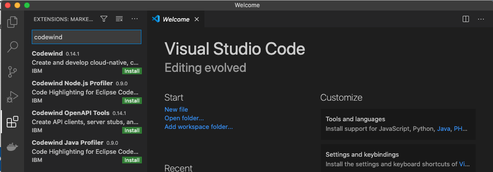

Click on install for the **latest Codewind** version. 

Codewind requires the installation of **additional Docker images** to run. Choose Install when prompted to complete the installation. The installation may take a few minutes to complete.

When the installation is complete, you can open the **codewind-workspace **folder or a project within the workspace as your VS Code workspace. The tools offer to open the workspace for you if it’s not open already.

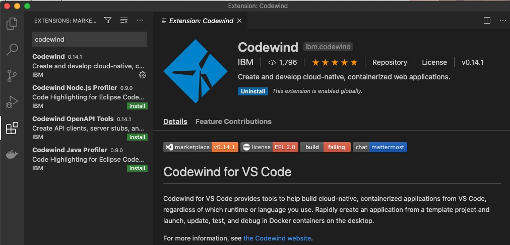

You will see Codewind at the bottom left part of the screen. Click on CodeWind:

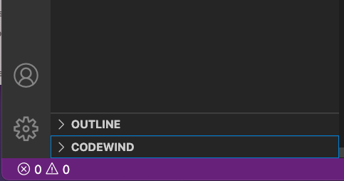


Start the local connection to docker by clicking on the button on the right side of local:

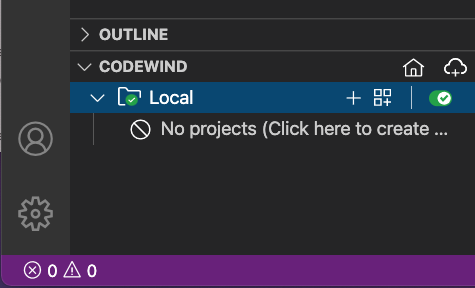 


Then Click on **No Projects** to create a new project.

Then select **Kabanero Stack-hub Node.js Express simple template** in the list:

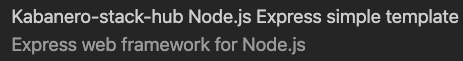


Finally type a name for your project like **myapp** directory:

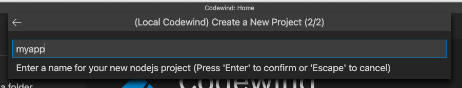

and put it in a **directory** of you choice (like myprojects)  and **select Parent Directory**

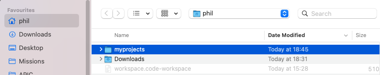

Then on the top left, you will see your directory **myapp** :

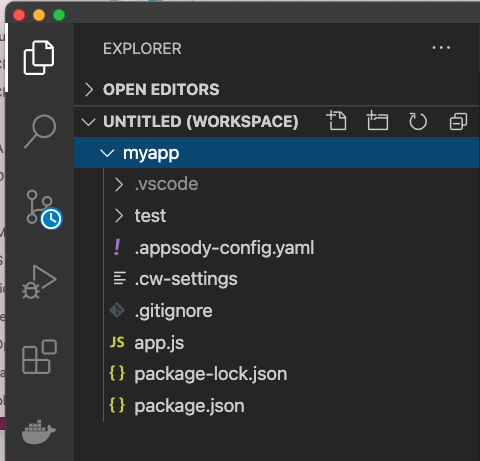


##Task #7 - Managing your project 

You should see your application building automatically:

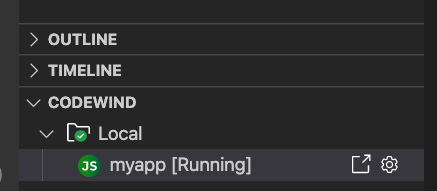

After a few seconds, your cloud native application should be building and **running**.

Move your cursor on myapp (running) item and click on the end point to get access to the application:

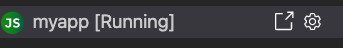

 A browser session will open shortly:


Now you can navigate on the left top pane to locate the project (mynewapp) and the program (app.js), click on the program (it will appear in the right pane):


Change the "Hello from Appsody" by "**Hello from Philippe !**"or any message of your choice. 


Save your project. Automatically a new build of your project is started and you change is operational:


Now let do some experiments, **right click** on **myapp** project in Codewind:

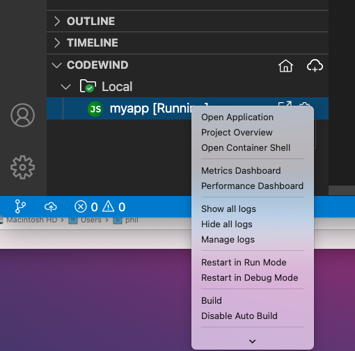

These commands are **Appsody** commands. 


##Task #8 - Managing your application

You can navigate from that codewind menu to see different aspects of your application.

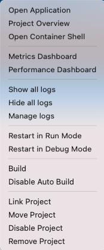

First you can open your application (**Open Application**):

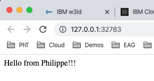

You can also see your project overview:

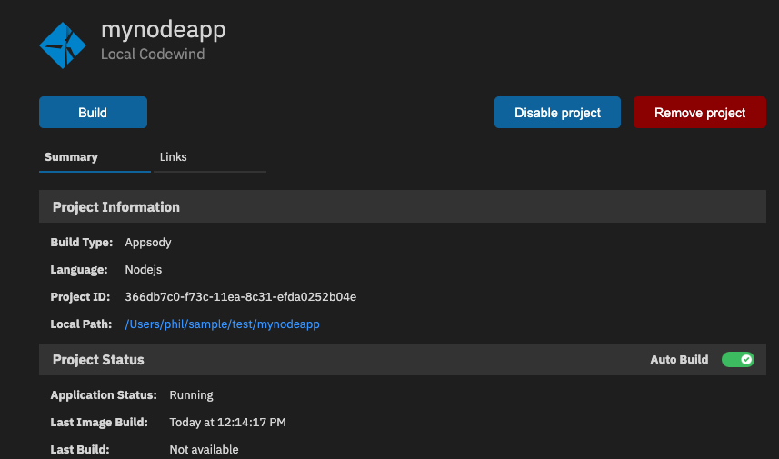

You can open a container shell (**Container Shell**) and type several commands:

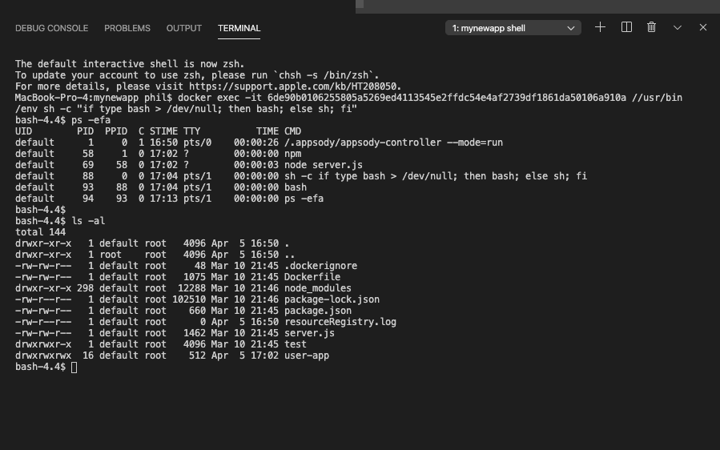

If we click on Metrics, you will see the following CPU, Memory, Heap, :

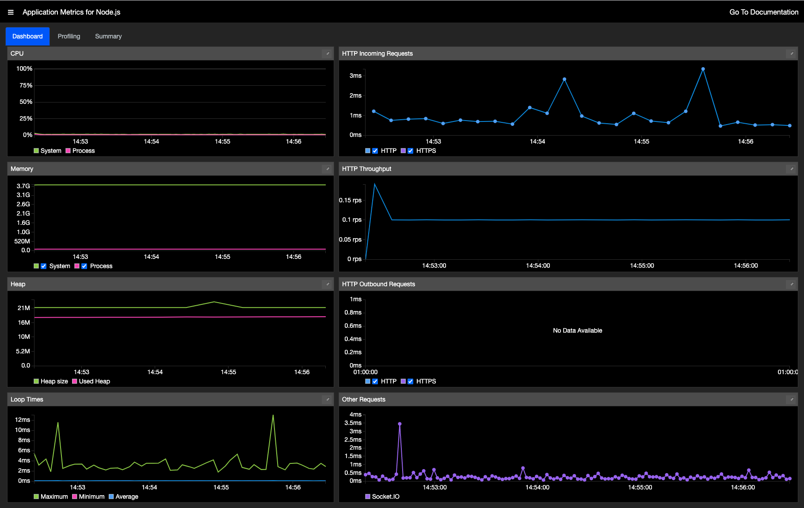

You can also play with the performance: Click on performance and then click on the button to edit the parameters :


Then enter a **name** and click **Enter**:

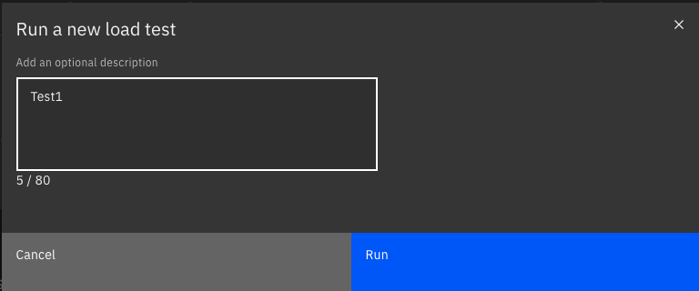

And look at the results after 180 secondes:

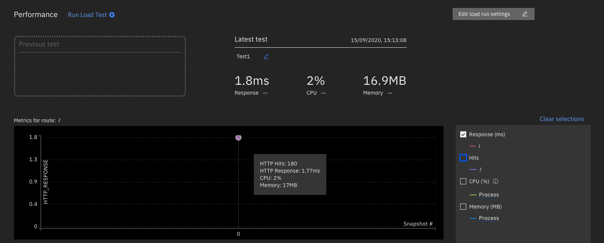


## Task #9 - Deploying your application


Check or re-assign your project:

```bash
oc project labproj<xx>
```

Results:

```
oc project
Using project "labproj99" on server "https://nice-cluster-3f022ac5fd-master-0.IBM-OpenShift.cloud:8443".
```

In your application directory where you have **mynodeapp**, login to your Docker registry in your cluster:

``` 
HOST=$(oc get route default-route -n openshift-image-registry --template='{{ .spec.host }}')
echo $HOST
docker login $HOST -u openshift -p $(oc whoami -t) 
```

Example:

```bash
# HOST=$(oc get route default-route -n openshift-image-registry --template='{{ .spec.host }}')
# echo $HOST
default-route-openshift-image-registry.niceam-ba36b2ed0b6b09dbc627b56ceec2f2a4-0000.us-south.containers.appdomain.cloud

# docker login $HOST -u openshift -p $(oc whoami -t) 
 docker login $HOST -u openshift -p $(oc whoami -t)
WARNING! Using --password via the CLI is insecure. Use --password-stdin.
Login Succeeded
```


> If you receive an error message with X509,  you must add the **client-ca.crt** certificate on your system. This file is in the github in the same repository. See the appendix at the end.


Be sure to be on your application directory:

```bash
cd
cd myprojects/myapp
```


Now you can deploy your appliocation to the remote OpenShift cluster in your project (**change xx** with your number)

```bash
appsody deploy -t $HOST/labproj<xx>/myapp --push --pull-url image-registry.openshift-image-registry.svc:5000 -n labproj<xx>
```


Results (example) : **it can take a few minutes**

```
...
[Docker]  ---> 00ae30f1cbb7
[Docker] Successfully built 00ae30f1cbb7
[Docker] Successfully tagged default-route-openshift-image-registry.nicebb-ba36b2ed0b6b09dbc627b56ceec2f2a4-0000.eu-gb.containers.appdomain.cloud/labproj99/mynodeapp:latest
Pushing image default-route-openshift-image-registry.nicebb-ba36b2ed0b6b09dbc627b56ceec2f2a4-0000.eu-gb.containers.appdomain.cloud/labproj99/mynodeapp
Built docker image default-route-openshift-image-registry.nicebb-ba36b2ed0b6b09dbc627b56ceec2f2a4-0000.eu-gb.containers.appdomain.cloud/labproj99/mynodeapp
Running command: docker create --name mynodeapp-extract docker.io/kabanero/nodejs-express:0.4
Running command: docker cp mynodeapp-extract:/config/app-deploy.yaml /Users/phil/sample/test/mynodeapp/app-deploy.yaml
Running command: docker rm mynodeapp-extract -f
Created deployment manifest: /Users/phil/sample/test/mynodeapp/app-deploy.yaml
Attempting to get resource from Kubernetes ...
Running command: kubectl get pods "-o=jsonpath='{.items[?(@.metadata.labels.name==\"appsody-operator\")].metadata.namespace}'" --all-namespaces
Attempting to get resource from Kubernetes ...
Running command: kubectl get deployments "-o=jsonpath='{.items[?(@.metadata.name==\"appsody-operator\")].metadata.namespace}'" -n openshift-operators
Attempting to get resource from Kubernetes ...
Running command: kubectl get pod "-o=jsonpath='{.items[?(@.metadata.labels.name==\"appsody-operator\")].metadata.name}'" -n openshift-operators
Attempting to get resource from Kubernetes ...
Running command: kubectl exec -n openshift-operators -it appsody-operator-f5bd99cb9-hhb4h -- /bin/printenv WATCH_NAMESPACE
An operator exists in namespace openshift-operators, that is watching all namespaces
Attempting to apply resource in Kubernetes ...
Running command: kubectl apply -f /Users/phil/sample/test/mynodeapp/app-deploy.yaml --namespace labproj99
Appsody Deployment name is: myapp
Running command: kubectl get rt myapp -o "jsonpath=\"{.status.url}\"" --namespace labproj99
Attempting to get resource from Kubernetes ...
Running command: kubectl get route myapp -o "jsonpath={.status.ingress[0].host}" --namespace labproj99
Deployed project running at myapp-labproj99.nicebb-ba36b2ed0b6b09dbc627b56ceec2f2a4-0000.eu-gb.containers.appdomain.cloud
```

It can take a **few nimutes** to push and deploy the application. 

You can now get access to your application by using the URL from the last message of the deploy:

```https
https://myapp-labproj99.nicebb-ba36b2ed0b6b09dbc627b56ceec2f2a4-0000.eu-gb.containers.appdomain.cloud
```

 


## Conclusion

You successfully installed and used Appsody, Kabanero and Codewind ! You used most of the features concerning Codewind and Appsody. These tools are solving a lot of complexity for the developers. 

**Congratulations**


----

----


# End of Lab


